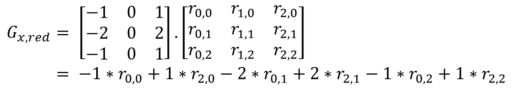

# Lab 02 Instructions

## Unit testing

Unit testing is a form of testing that focusses on testing 'small' regions 
of code extensively. This is often part of a code development strategy 
known as Test-driven development.

As opposed to end-to-end testing (which treats the program as a 
black-box and looks at the final outputs for test inputs) unit testing 
generally follows a white-box approach. Thus, unit tests are able to run small
snippets of code, and deeply inspect program state. For example, unit tests
are able to read and check state within data structures and objects. When 
testing a single function, unit-testing also allows testing of obscure 
paths which might be harder to trigger in an end-to-end test. However, 
unit-testing is not an exhaustive approach and is only as complete
as the number of edge-cases that the programmer can envision and implement 
tests for. 

The exact use of unit-tests depends on the requirements of the program being
tested, but typically includes tests for functionality on known, simple 
inputs and outputs, and tests for corner cases and errors. 
The functionality tests also allow the programmer to check when program 
behavior deviates from expected, and thus, to debug their programs. This is 
where unit testing fits into the development <=> testing cycle. 
The tests for corner cases and errors are used to check for bugs on the 
error handling paths.

The code for this lab is based on the png library introduced in the first 
lab. We provide you with 4 implemented filters, for which you are required 
to write unit-tests. You are also required to implement four other filters, 
for which we provide the unit tests. 


## Check: The unit testing framework

In this lab, we shall use the Check unit testing framework 
(https://libcheck.github.io/check/) for C. The framework allows the user to
define tests within `START_TEST` and `END_TEST` macros. Within each test, 
checks are implemented by `ck_assert_*()` function calls. An example test
for a function implementing addition of two integers might look like this:

```C
START_TEST(addition_test) {
  /* Testing equality between two integers */
  ck_assert_int_eq(sum(1, 2), 1 + 2);

  /* Test inequality between two integers */
  ck_assert_int_gt(sum(1, 2), 2);
}
END_TEST
```

An example output for a unit test run is shown below. Note that of four tests, 
only one passed. `failed_test` failed an equality check on line 11. 
`crashing_test` generated a SEGFAULT. `timeout_test` timed-out after the 
default timeout of 4 seconds (see CK_DEFAULT_TIMEOUT).

```
Running suite(s): Example testsuite
25%: Checks: 4, Failures: 1, Errors: 2
tests.c:6:P:Example tests:successful_test:0: Passed
tests.c:11:F:Example tests:failed_test:0: Assertion 'fancy_sum(1u, 2u) == 1u + 2u' failed: fancy_sum(1u, 2u) == 3221342974, 1u + 2u == 3
tests.c:15:E:Example tests:crashing_test:0: (after this point) Received signal 11 (Segmentation fault)
tests.c:20:E:Example tests:timeout_test:0: (after this point) Test timeout expired
```

You will find more example tests implemented in the file `tests.c`. You will
also have to add more tests at the locations marked `TODO`. 


## TODO for the lab

There are two major parts to this lab: implementing tests for existing 
filters and adding more filters for which we provide unit tests.

### Writing unit tests

#### Unit test for negative filter: functionality

Generate a black image of random size (in range `[1,511]`), with all 
alpha channels set to `128`. Run the negative filter, checking that 
all pixels are white. Also check that the alpha channel is untouched.

Run the negative filter again to check that the image is now all black
with the same transparency.

> Note: do not forget to initialize the random number generator before
> generating any random values.

#### Unit tests for negative filter: edge case

Generate a `0x0` image, and run the negative filter. This test checks that
the filter does not crash on this input.

#### Unit test for blur filter: functionality

For the given image, check that the output of the blur filter is correct
over different values of the radius: `0`, `1`, `2`, and `3`. You might want to 
duplicate the given image using the `duplicate_img` function and run the
tests on the duplicated image. For each blur radius, check each pixel. 

For radius 0, the image does not change. With pixels 
`dark0 = {28, 28, 28, 255}`, `dark1 = {42, 42, 42, 255}`, and 
`dark2 = {63, 63, 63, 255}`, the expected output for radius 1 is:

```
dark2 dark1 dark2
dark1 dark0 dark1
dark2 dark1 dark2
```

For larger radii, all pixels should be `dark0`.

#### Unit test for blur filter: edge case

Generate a random image, and run the blur filter on it with a variety of
radii. You may duplicate one random image and run filters on the duplicates.

The set of radii to be used are `{INT_MIN, INT_MAX, 0, image_width,
image_height}` along with all of these divided by `2`, and all of these `+- 1`.

Overall, there will be `5 * 4` calls to the blur filter.

#### Unit test for transparency filter: functionality

Generate a random image, and a random transparency. Apply the filter and 
check that the transparency was properly set to all pixels.

#### Unit test for transparency filter: edge case

Call the transparency filter with a `nullptr` for the image. This test should
cause a segmentation fault. This is an example of a test which exposes 
a bug in the code. In an usual scenario, this would lead to the developer
triaging and fixing the bug in the library. For this lab, you are not 
expected to do this.

#### Unit test for grayscale filter: functionality

There is one implemented test for grayscale functionality: 
`grayscale_functionality`. You are required to implement another
`grayscale_examples`. 

For this test, you are required to run the grayscale filter with defined
weights on the inputs defined in `grayscale_sources`, and compare them
to the outputs defined in `grayscale_output`. This test loops over a set 
of inputs, similar to `edge_example_image`. The alpha channel should be
unaffected.

You will also need to add this test to `main` in the position indicated.
You can look at other tests for the syntax for `tcase_add_loop_test`.

> Note: For tests using `tcase_add_loop_test`, there is an implicitly defined
> variable `_i` which is the iteration of the test.


#### Unit test for grayscale filter: edge cases

There is already one implemented test for grayscale edge cases:
`grayscale_double_limit`.


### Additional filters

In this lab, you will be required to implement four additional filters:

1. Sepia: Gives photos an old-time reddish tint
1. Black & White: Replaces all pixels with black or white
1. Edge-detection: Detects edges in the image by looking for sudden changes 
   in color between neighboring pixels.
1. Keying: Used in green-screen processing, this filter makes all pixels
   matching one color transparent, allowing later superposition onto a
   background image.

You will find unit tests for these filters in `tests.c`. Your implementation 
must pass these tests.

#### Sepia filter

The sepia filter is parameterized by a single `uint8_t` parameter representing 
depth. The resulting pixels are calculated as below. Values are capped to 255. 

```
r = ave(r, g, b) + 2 * depth
g = ave(r, g, b) + depth
b = ave(r, g, b)
```

The transparency of the pixel is not affected.

#### Black and white filter

The B&W filter is parameterized by a single `uint8_t` parameter representing a
threshold. The output pixel is white if the `avg(r, g, b)` exceeds the
threshold. Otherwise, the output pixel is black.
The transparency of the pixel is not affected.

#### Edge detection filter

The edge detection algorithm works by calculating a gradient at each pixel 
based on how much the values of the colors change across each axis. For each 
pixel, the gradient depends on the neighboring pixels.

You are require to calculate gradients per pixel, per axis `(x,y)`, per color. 
The gradients are calculated as the convolution of predefined matrices `G_x` 
and `G_y`. For example, for the pixel at `(1,1)`, the gradient for red is:



Next, the gradient per channel are calculated.


Finally, the net gradient is calculated and compared with the threshold. A 
gradient larger than the threshold denotes an edge, and the pixel is colored
black, otherwise black.
The transparency of the pixel is not affected.


#### Keying filter

This takes the key pixel as argument. Each pixel in the image whose
`rgb` channels match the key are made transparent. Other pixels are 
not affected.


## Common gotchas

The behavior of `check` depends on an environment variable 
`CK_FORK`. If this variable is `yes` or undefined, Check forks before
running each tests, thereby running each test in a different process. 
This allows each test to be independent, and bugs in one test do not
affect other tests. This means that when trying to debug `tests` with 
`gdb`, you will see the below output. Despite setting a breakpoint, 
you might see that the breakpoint is never hit. This is because `gdb` 
continues debugging the parent process by default on a fork, while the
actual tests run in children. 

```
(gdb) b tests.c:521
Breakpoint 1 at 0x6ee9: file tests.c, line 521.
(gdb) r
Starting program: /home/abhattac/Documents/cs412/SoftSec/lab/Spring2020/lab0x01/expected/tests 
[Thread debugging using libthread_db enabled]
Using host libthread_db library "/lib/x86_64-linux-gnu/libthread_db.so.1".
Running suite(s): lib-Y0l0 tests
[Detaching after fork from child process 6645]
[Detaching after fork from child process 6646]
[Detaching after fork from child process 6647]
[Detaching after fork from child process 6648]
[Detaching after fork from child process 6649]
...
```

To debug tests with `gdb`, either set the environment variable `CK_FORK`
to `no`. You can do this from within `gdb` by running the command 
`set env CK_FORK=no`. This has the advantage that all your tests run in 
one process and your breakpoints will be hit. However, this can lead to 
bugs from one test affecting other tests. Specially for bugs involving 
the memory allocator (`malloc`/`free` et al.) these bugs can get really
difficult to find/debug.

The other option is to ask `gdb` to follow the child on a fork. This can
be done with the command `set follow-fork-mode child`. This must be done
just before the test which you want to debug. 

